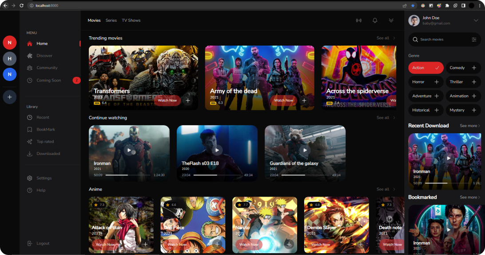

# Movie App

This is a movie app built with Laravel. The app is currently in development, but when completed, it will have the following features:

## Features
- User authentication: Users will be able to log in to different accounts.
- Movie browsing: Users will be able to view movies and see different categories of movies.
- Movie watching: Users will be able to watch movies.

## Screenshots

## Installation
To install the app, follow these steps:

1. Clone the repository.
2. Run `composer install` to install dependencies.
3. Run `php artisan serve` to start the server.

## Credits
Developed by [Favourdev](https://github.com/Favourdev1).

We'll update this README file as we continue to develop the app. Stay tuned for more updates!